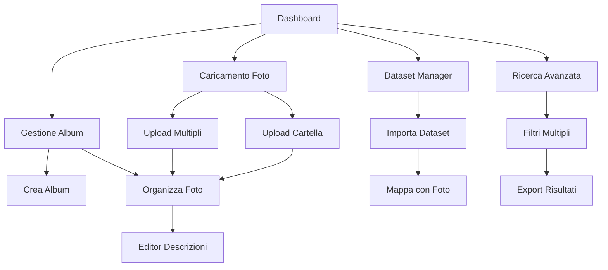

## 1. Product Overview
Piattaforma per la gestione e organizzazione di contenuti multimediali e dati. Permette agli utenti di caricare foto singole o in blocco, intere cartelle di immagini, aggiungere descrizioni dettagliate e importare dataset di dati strutturati.
- Risolve il problema della gestione disorganizzata di contenuti digitali e dati
- Utenti: fotografi, ricercatori, team di progetto che necessitano di organizzare visualizzazioni e dati
- Valore: centralizzazione e strutturazione di contenuti multimediali con metadati richiesti

## 2. Core Features

### 2.1 User Roles
| Role | Registration Method | Core Permissions |
|------|---------------------|------------------|
| Utente Base | Registrazione email | Caricare foto, creare album, aggiungere descrizioni |
| Utente Pro | Upgrade con pagamento | Caricare cartelle intere, gestire dataset, API access |
| Admin | Designato internamente | Gestione utenti, moderazione contenuti, analytics |

### 2.2 Feature Module
La piattaforma richiede le seguenti pagine principali:
1. **Dashboard**: panoramica contenuti, statistiche caricamenti, navigazione rapida
2. **Caricamento Foto**: upload singolo/multiplo, drag & drop, preview immagini
3. **Gestione Album**: creazione cartelle, organizzazione gerarchica, rinominazione
4. **Editor Descrizioni**: aggiunta metadati, tag, categorizzazione, ricerca testuale
5. **Dataset Manager**: importazione file CSV/JSON, visualizzazione dati, correlazione con foto
6. **Ricerca Avanzata**: filtri per data, tag, contenuto, export risultati

### 2.3 Page Details
| Page Name | Module Name | Feature description |
|-----------|-------------|---------------------|
| Dashboard | Statistiche | Visualizza numero totale foto, spazio utilizzato, ultimi caricamenti con grafici interattivi |
| Dashboard | Quick Actions | Pulsanti rapidi per nuovo upload, creazione album, importa dataset |
| Caricamento Foto | Upload Area | Drag & drop multipli, selezione cartella, barra progresso, annulla operazione |
| Caricamento Foto | Preview | Thumbnail anteprime, rotazione immagini, rimuovi singoli file |
| Gestione Album | Albero Cartelle | Navigazione gerarchica, creazione sottocartelle, sposta elementi tra cartelle |
| Gestione Album | Toolbar Azioni | Rinomina, elimina, condividi, download zip multipli selezionati |
| Editor Descrizioni | Form Metadati | Campi titolo, descrizione, data, location, persone taggate, keywords |
| Editor Descrizioni | Bulk Edit | Modifica multipla descrizioni, applicazione tag a gruppi di foto |
| Dataset Manager | Import Wizard | Step-by-step per CSV/JSON, mappatura colonne, validazione dati |
| Dataset Manager | Correlation Tool | Collega righe dataset a foto specifiche, visualizzazione relazioni |
| Ricerca Avanzata | Filtri Combinati | Data range, tag multipli, contenuto testuale, tipo file, dimensione |
| Ricerca Avanzata | Export Results | Download selezionati, generazione report PDF, condivisione link |

## 3. Core Process
### Flusso Utente Base:
1. Login → Dashboard → Carica Foto → Organizza in Album → Aggiungi Descrizioni
2. Dashboard → Cerca Contenuti → Visualizza Risultati → Esporta Selezione

### Flusso Utente Pro:
1. Dashboard → Importa Dataset → Mappa con Foto → Analizza Correlazioni
2. Gestione Album → Carica Cartella → Auto-categorizzazione → Bulk Edit

## 4. User Interface Design

### 4.1 Design Style
- **Colori Primari**: Blu scuro #1a365d, Blu chiaro #3182ce, Bianco #ffffff
- **Colori Secondari**: Grigio chiaro #f7fafc, Grigio scuro #2d3748, Verde success #38a169
- **Button Style**: Rounded corners (8px), hover effects, shadow subtle
- **Typography**: Inter font family, titoli 24-32px, body 14-16px
- **Layout**: Card-based con grid responsive, sidebar navigation collassabile
- **Icone**: SVG outline style, consistenti con design system moderno

### 4.2 Page Design Overview
| Page Name | Module Name | UI Elements |
|-----------|-------------|-------------|
| Dashboard | Statistiche | Card layout 3x2 grid, chart.js grafici colorati, metriche prominenti |
| Caricamento Foto | Upload Area | Dropzone grande con bordo tratteggiato, area drag highlight blu, progress bar orizzontale |
| Gestione Album | Albero Cartelle | Sidebar sinistro espandibile, icona cartella, contatore elementi, drag & drop visual |
| Editor Descrizioni | Form Metadati | Form a 2 colonne, input con label sopra, textarea espandibile, tag input con chips |
| Dataset Manager | Import Wizard | Step indicator in alto, form per step, validazione real-time, tabella preview dati |
| Ricerca Avanzata | Filtri Combinati | Filter sidebar slide-in, chips per filtri attivi, risultati in card grid responsivo |

### 4.3 Responsiveness
Desktop-first design con adattamento mobile completo. Breakpoints: 320px, 768px, 1024px, 1440px. Touch optimization per upload drag & drop su dispositivi mobile. Sidebar diventa bottom navigation su mobile.

### 4.4 3D Scene Guidance
Non applicabile - piattaforma 2D per gestione contenuti.