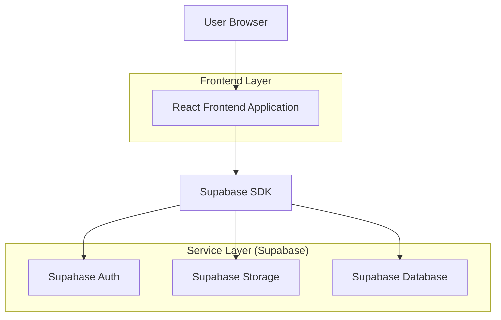
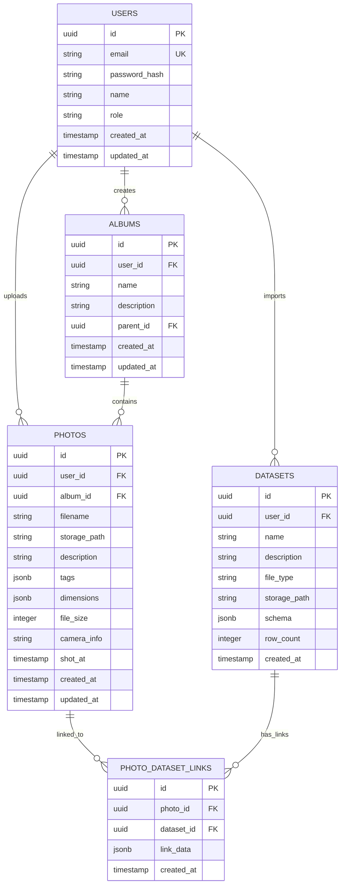

## 1. Architecture design



## 2. Technology Description

* Frontend: React\@18 + tailwindcss\@3 + vite

* Initialization Tool: vite-init

* Backend: Supabase (BaaS)

* Storage: Supabase Storage per foto e dataset

* Database: Supabase PostgreSQL per metadati e relazioni

## 3. Route definitions

| Route       | Purpose                                              |
| ----------- | ---------------------------------------------------- |
| /           | Dashboard principale con statistiche e quick actions |
| /upload     | Pagina caricamento foto con drag & drop multiplo     |
| /albums     | Gestione album e cartelle gerarchiche                |
| /albums/:id | Dettaglio album con griglia foto e editor            |
| /photos/:id | Pagina dettaglio singola foto con editor descrizioni |
| /datasets   | Manager per importazione e visualizzazione dataset   |
| /search     | Ricerca avanzata con filtri combinati                |
| /profile    | Profilo utente e impostazioni                        |
| /login      | Pagina autenticazione                                |
| /register   | Pagina registrazione nuovo utente                    |

## 4. API definitions

### 4.1 Supabase Storage APIs

**Upload Multipli Foto**

```javascript
// Client-side direct to Supabase Storage
const { data, error } = await supabase.storage
  .from('photos')
  .upload(`user_${userId}/${timestamp}_${filename}`, file, {
    cacheControl: '3600',
    upsert: false
  })
```

**Upload Dataset**

```javascript
const { data, error } = await supabase.storage
  .from('datasets')
  .upload(`user_${userId}/datasets/${filename}`, file)
```

### 4.2 Database Operations

**Salva Metadati Foto**

```javascript
const { data, error } = await supabase
  .from('photos')
  .insert([
    {
      user_id: userId,
      storage_path: path,
      filename: filename,
      description: description,
      tags: tags,
      album_id: albumId,
      file_size: size,
      dimensions: { width, height }
    }
  ])
```

**Cerca con Filtri**

```javascript
let query = supabase
  .from('photos')
  .select('*')
  
if (searchTerm) {
  query = query.textSearch('description', searchTerm)
}
if (tags.length > 0) {
  query = query.contains('tags', tags)
}
if (dateFrom) {
  query = query.gte('created_at', dateFrom)
}

const { data, error } = await query
```

## 5. Server architecture diagram

Non applicabile - Architettura serverless con Supabase

## 6. Data model

### 6.1 Data model definition



### 6.2 Data Definition Language

**Users Table**

```sql
CREATE TABLE users (
    id UUID PRIMARY KEY DEFAULT gen_random_uuid(),
    email VARCHAR(255) UNIQUE NOT NULL,
    password_hash VARCHAR(255) NOT NULL,
    name VARCHAR(100) NOT NULL,
    role VARCHAR(20) DEFAULT 'user' CHECK (role IN ('user', 'pro', 'admin')),
    created_at TIMESTAMP WITH TIME ZONE DEFAULT NOW(),
    updated_at TIMESTAMP WITH TIME ZONE DEFAULT NOW()
);
```

**Albums Table**

```sql
CREATE TABLE albums (
    id UUID PRIMARY KEY DEFAULT gen_random_uuid(),
    user_id UUID REFERENCES users(id) ON DELETE CASCADE,
    name VARCHAR(255) NOT NULL,
    description TEXT,
    parent_id UUID REFERENCES albums(id) ON DELETE CASCADE,
    created_at TIMESTAMP WITH TIME ZONE DEFAULT NOW(),
    updated_at TIMESTAMP WITH TIME ZONE DEFAULT NOW()
);

CREATE INDEX idx_albums_user_id ON albums(user_id);
CREATE INDEX idx_albums_parent_id ON albums(parent_id);
```

**Photos Table**

```sql
CREATE TABLE photos (
    id UUID PRIMARY KEY DEFAULT gen_random_uuid(),
    user_id UUID REFERENCES users(id) ON DELETE CASCADE,
    album_id UUID REFERENCES albums(id) ON DELETE SET NULL,
    filename VARCHAR(255) NOT NULL,
    storage_path VARCHAR(500) NOT NULL,
    description TEXT,
    tags JSONB DEFAULT '[]',
    dimensions JSONB,
    file_size INTEGER,
    camera_info JSONB,
    shot_at TIMESTAMP WITH TIME ZONE,
    created_at TIMESTAMP WITH TIME ZONE DEFAULT NOW(),
    updated_at TIMESTAMP WITH TIME ZONE DEFAULT NOW()
);

CREATE INDEX idx_photos_user_id ON photos(user_id);
CREATE INDEX idx_photos_album_id ON photos(album_id);
CREATE INDEX idx_photos_created_at ON photos(created_at DESC);
```

**Datasets Table**

```sql
CREATE TABLE datasets (
    id UUID PRIMARY KEY DEFAULT gen_random_uuid(),
    user_id UUID REFERENCES users(id) ON DELETE CASCADE,
    name VARCHAR(255) NOT NULL,
    description TEXT,
    file_type VARCHAR(10) CHECK (file_type IN ('csv', 'json')),
    storage_path VARCHAR(500) NOT NULL,
    schema JSONB,
    row_count INTEGER DEFAULT 0,
    created_at TIMESTAMP WITH TIME ZONE DEFAULT NOW()
);

CREATE INDEX idx_datasets_user_id ON datasets(user_id);
```

**Photo Dataset Links Table**

```sql
CREATE TABLE photo_dataset_links (
    id UUID PRIMARY KEY DEFAULT gen_random_uuid(),
    photo_id UUID REFERENCES photos(id) ON DELETE CASCADE,
    dataset_id UUID REFERENCES datasets(id) ON DELETE CASCADE,
    link_data JSONB,
    created_at TIMESTAMP WITH TIME ZONE DEFAULT NOW(),
    UNIQUE(photo_id, dataset_id)
);

CREATE INDEX idx_links_photo_id ON photo_dataset_links(photo_id);
CREATE INDEX idx_links_dataset_id ON photo_dataset_links(dataset_id);
```

**Supabase Row Level Security (RLS)**

```sql
-- Enable RLS
ALTER TABLE users ENABLE ROW LEVEL SECURITY;
ALTER TABLE albums ENABLE ROW LEVEL SECURITY;
ALTER TABLE photos ENABLE ROW LEVEL SECURITY;
ALTER TABLE datasets ENABLE ROW LEVEL SECURITY;
ALTER TABLE photo_dataset_links ENABLE ROW LEVEL SECURITY;

-- Grant permissions
GRANT SELECT ON users TO anon;
GRANT ALL ON users TO authenticated;
GRANT SELECT ON albums TO anon;
GRANT ALL ON albums TO authenticated;
GRANT SELECT ON photos TO anon;
GRANT ALL ON photos TO authenticated;
GRANT SELECT ON datasets TO anon;
GRANT ALL ON datasets TO authenticated;
GRANT SELECT ON photo_dataset_links TO anon;
GRANT ALL ON photo_dataset_links TO authenticated;

-- RLS Policies
CREATE POLICY "Users can view own profile" ON users FOR SELECT USING (auth.uid() = id);
CREATE POLICY "Users can update own profile" ON users FOR UPDATE USING (auth.uid() = id);
CREATE POLICY "Users can manage own albums" ON albums FOR ALL USING (auth.uid() = user_id);
CREATE POLICY "Users can manage own photos" ON photos FOR ALL USING (auth.uid() = user_id);
CREATE POLICY "Users can manage own datasets" ON datasets FOR ALL USING (auth.uid() = user_id);
CREATE POLICY "Users can manage own links" ON photo_dataset_links FOR ALL USING (
  auth.uid() IN (SELECT user_id FROM photos WHERE id = photo_id)
);
```

