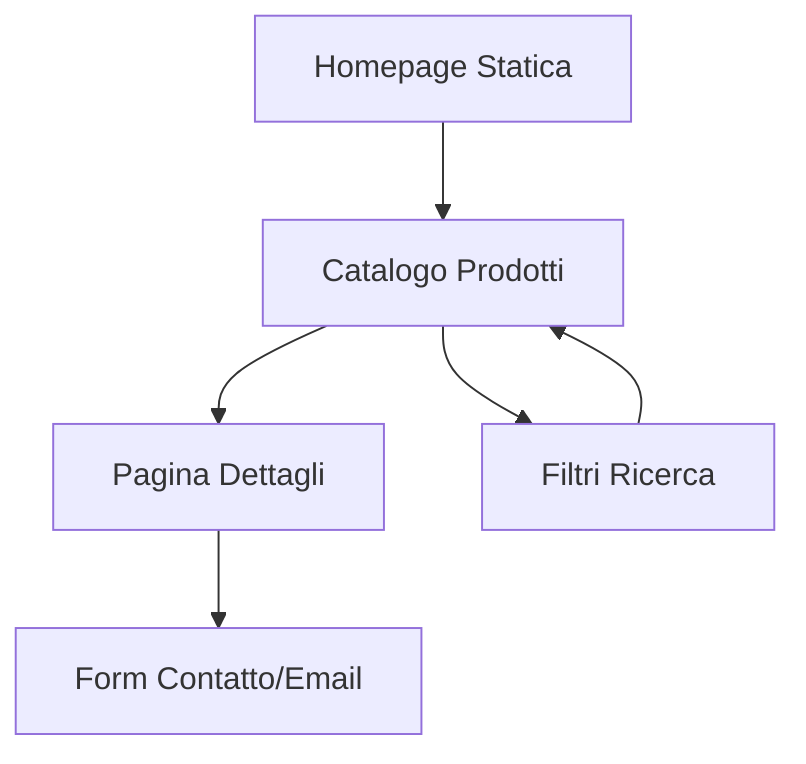

## 1. Product Overview
Esportazione statica del sito Roulotte Pro per permettere la visualizzazione del catalogo senza server backend. Il prodotto consiste in file HTML statici che replicano le funzionalità principali del sito dinamico.

- **Problema da risolvere**: Il sito attuale richiede un server Node.js attivo per funzionare
- **Utenti target**: Clienti finali che vogliono visualizzare il catalogo roulottes
- **Valore**: Catalogo consultabile offline o su hosting statico economico

## 2. Core Features

### 2.1 User Roles
| Role | Access Method | Core Permissions |
|------|---------------|------------------|
| Visitor | Direct access to static files | Browse catalog, view product details |

### 2.2 Feature Module
Il progetto di esportazione statica consiste nelle seguenti pagine principali:

1. **Homepage statica**: Presentazione del catalogo con lista roulottes
2. **Catalogo statico**: Griglia di tutte le roulottes disponibili con filtri
3. **Pagina dettagli**: Scheda tecnica completa di ogni singola roulotte
4. **Pagine supporto**: About, contatti, termini

### 2.3 Page Details
| Page Name | Module Name | Feature description |
|-----------|-------------|---------------------|
| Homepage | Hero section | Presentazione brand e call-to-action verso catalogo |
| Homepage | Featured products | Sezione con roulottes in evidenza (pubblicate) |
| Homepage | Navigation | Menu principale per accesso a catalogo e pagine statiche |
| Catalogo | Product grid | Griglia responsive di card prodotto con immagini |
| Catalogo | Filters sidebar | Filtri per marca, prezzo, anno, stato |
| Catalogo | Search functionality | Barra di ricerca testuale |
| Dettagli | Image gallery | Galleria fotografica con zoom e navigazione |
| Dettagli | Product specs | Tabella tecnica con tutte le specifiche |
| Dettagli | Price display | Prezzo con eventuale sconto e indicazione trattabile |
| Dettagli | Contact CTA | Pulsanti per richiedere informazioni via email/form |

## 3. Core Process
**Flusso visitatore**: Homepage → Catalogo → Pagina Dettagli → Contatto venditore

## 4. User Interface Design

### 4.1 Design Style
- **Colori primari**: Rosso #e11d48 (brand), Bianco #ffffff, Grigio scuro #1f2937
- **Colori secondari**: Grigio chiaro #f3f4f6, Grigio testo #6b7280
- **Typography**: Font Inter (Google Fonts), pesanti 400-700
- **Layout**: Card-based con griglia responsive
- **Bottoni**: Stile piatto con bordi arrotondati, hover effects
- **Icone**: SVG minimaliste, stile linea outline

### 4.2 Page Design Overview
| Page Name | Module Name | UI Elements |
|-----------|-------------|-------------|
| Homepage | Hero section | Immagine full-width con testo sovrapposto, CTA button rosso |
| Catalogo | Product grid | Card 4-col desktop → 1-col mobile, immagine 4:3, badge condizione |
| Catalogo | Filters | Sidebar sinistra desktop, off-canvas mobile, checkbox e range slider |
| Dettagli | Gallery | Layout 2-col, immagine principale grande, thumbnails orizzontali |
| Dettagli | Info panel | Card bianca con ombra, specifiche in griglia, prezzo prominente |

### 4.3 Responsiveness
- Desktop-first approach
- Breakpoint principale: 768px
- Mobile: menu hamburger, single column layout
- Touch optimization per swipe gallery

### 4.4 Performance Requirements
- Tempo di caricamento < 3 secondi
- Immagini ottimizzate con lazy loading
- CSS/JS minificati e compressi
- CDN per assets statici