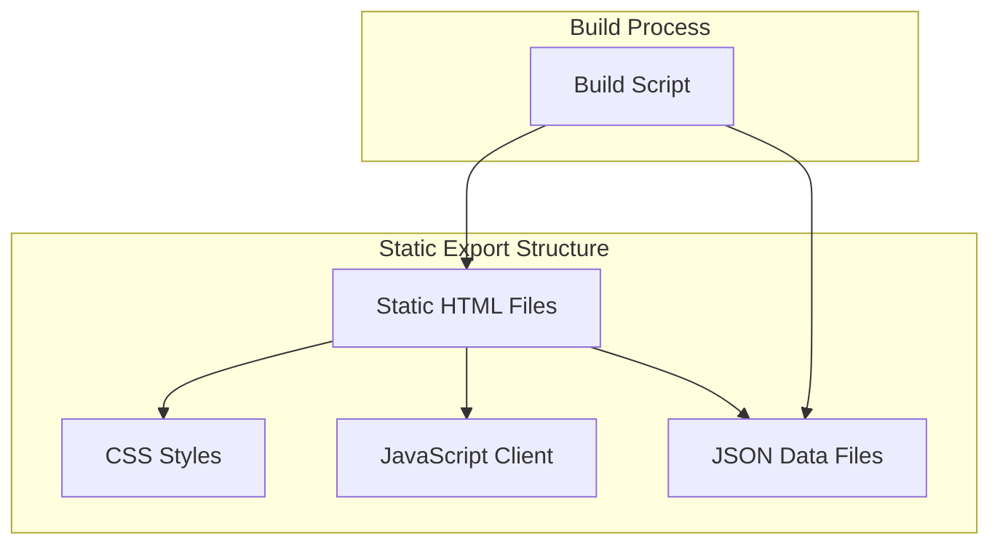

## 1. Architecture design



## 2. Technology Description
- **Frontend**: HTML5 + CSS3 + Vanilla JavaScript
- **Build Tool**: Node.js script per generazione statica
- **Data Source**: JSON files generati da database esistente
- **Deployment**: Any static hosting (Netlify, Vercel, GitHub Pages)

## 3. Route definitions
| Route | Purpose |
|-------|---------|
| /index.html | Homepage con presentazione e prodotti in evidenza |
| /catalogo.html | Catalogo completo con griglia prodotti |
| /dettagli/{id}.html | Pagina dettagli singolo prodotto |
| /assets/css/style.css | Stili condivisi |
| /assets/js/catalog.js | JavaScript per filtri e interazioni |
| /data/products.json | Dataset prodotti esportati |

## 4. Build Process API

### 4.1 Data Export
```javascript
// Script: export-static.js
const exportProducts = () => {
  const products = loadFromDatabase();
  const publicProducts = products.filter(p => p.pubblico);
  fs.writeFileSync('./static/data/products.json', JSON.stringify(publicProducts));
};
```

### 4.2 HTML Generation
```javascript
const generateCatalogPage = (products) => {
  const template = fs.readFileSync('./templates/catalogo.html', 'utf8');
  const cards = products.map(p => generateProductCard(p)).join('');
  return template.replace('{{PRODUCTS}}', cards);
};
```

### 4.3 Detail Pages Generation
```javascript
const generateDetailPages = (products) => {
  products.forEach(product => {
    const html = generateDetailHTML(product);
    fs.writeFileSync(`./static/dettagli/${product.id}.html`, html);
  });
};
```

## 5. Data Structure

### 5.1 Products JSON Schema
```json
{
  "products": [
    {
      "id": "string",
      "marca": "string",
      "modello": "string", 
      "anno": "number",
      "stato_generale": "string",
      "prezzo_consigliato": "number",
      "prezzo_richiesto": "number",
      "prezzo_listino": "number",
      "dimensioni": {
        "lunghezza": "string",
        "larghezza": "string"
      },
      "peso": {
        "massimo": "number"
      },
      "foto": [{"url": "string", "id": "string"}],
      "accessori": ["string"],
      "dettagli": {
        "info_generali": {
          "posti_letto": "number",
          "condizioni_veicolo": "string",
          "garanzia_mesi": "number"
        },
        "descrizione_testo": "string"
      }
    }
  ]
}
```

### 5.2 File Structure
```
static_export/
├── index.html
├── catalogo.html
├── dettagli/
│   ├── {id1}.html
│   ├── {id2}.html
│   └── ...
├── assets/
│   ├── css/
│   │   ├── main.css
│   │   └── catalog.css
│   ├── js/
│   │   ├── filters.js
│   │   └── gallery.js
│   └── images/
│       └── placeholder.jpg
├── data/
│   └── products.json
└── assets-original/
    ├── uploads/ (copiati da server)
    └── pdfs/ (copiati da server)
```

## 6. Build Script Implementation

### 6.1 Main Export Script
```javascript
// scripts/export-static.js
import fs from 'fs/promises';
import path from 'path';

const OUTPUT_DIR = './static_export';
const DATA_DIR = './server/data';
const PUBLIC_DIR = './server/public';

async function main() {
  // 1. Load data
  const roulottes = JSON.parse(await fs.readFile(`${DATA_DIR}/roulottes.json`, 'utf8'));
  
  // 2. Filter public products
  const publicProducts = roulottes.filter(r => r.pubblico);
  
  // 3. Create directory structure
  await fs.mkdir(`${OUTPUT_DIR}/dettagli`, { recursive: true });
  await fs.mkdir(`${OUTPUT_DIR}/assets/css`, { recursive: true });
  await fs.mkdir(`${OUTPUT_DIR}/assets/js`, { recursive: true });
  await fs.mkdir(`${OUTPUT_DIR}/data`, { recursive: true });
  
  // 4. Generate data files
  await fs.writeFile(`${OUTPUT_DIR}/data/products.json`, JSON.stringify(publicProducts, null, 2));
  
  // 5. Generate HTML pages
  await generateHomepage(publicProducts);
  await generateCatalog(publicProducts);
  await generateDetailPages(publicProducts);
  
  // 6. Copy assets
  await copyAssets();
  
  console.log('✅ Static export completed!');
}

main().catch(console.error);
```

### 6.2 Template System
```javascript
// templates/base.html
const baseTemplate = `<!DOCTYPE html>
<html lang="it">
<head>
    <meta charset="UTF-8">
    <meta name="viewport" content="width=device-width, initial-scale=1.0">
    <title>{{TITLE}} - Roulotte Pro</title>
    <link rel="stylesheet" href="/assets/css/main.css">
</head>
<body>
    <header>{{HEADER}}</header>
    <main>{{CONTENT}}</main>
    <footer>{{FOOTER}}</footer>
    <script src="/assets/js/main.js"></script>
</body>
</html>`;
```

## 7. Deployment Strategy

### 7.1 Static Hosting Options
- **Netlify**: Deploy via drag-and-drop o Git integration
- **Vercel**: Ottimizzato per performance globale
- **GitHub Pages**: Hosting gratuito per repository pubblici
- **AWS S3**: Soluzione enterprise con CloudFront CDN

### 7.2 Build Automation
```yaml
# .github/workflows/static-export.yml
name: Export and Deploy
on:
  push:
    branches: [ main ]
jobs:
  build-and-deploy:
    runs-on: ubuntu-latest
    steps:
    - uses: actions/checkout@v2
    - name: Setup Node.js
      uses: actions/setup-node@v2
      with:
        node-version: '18'
    - run: npm install
    - run: node scripts/export-static.js
    - name: Deploy to GitHub Pages
      uses: peaceiris/actions-gh-pages@v3
      with:
        github_token: ${{ secrets.GITHUB_TOKEN }}
        publish_dir: ./static_export
```

## 8. Performance Optimization

### 8.1 Image Optimization
- Convertire immagini in WebP quando possibile
- Generare thumbnails multiple (small, medium, large)
- Implementare lazy loading nativo

### 8.2 Asset Optimization
- Minificare CSS e JavaScript
- Gzip compression abilitata sul server
- Cache headers configurati per assets statici

### 8.3 SEO Optimization
- Meta tags dinamici per ogni pagina
- Schema.org structured data
- Sitemap XML generato automaticamente